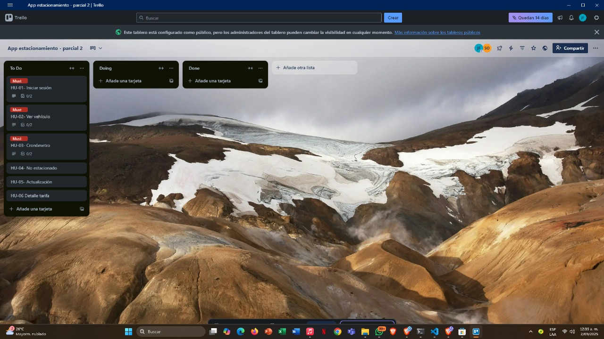
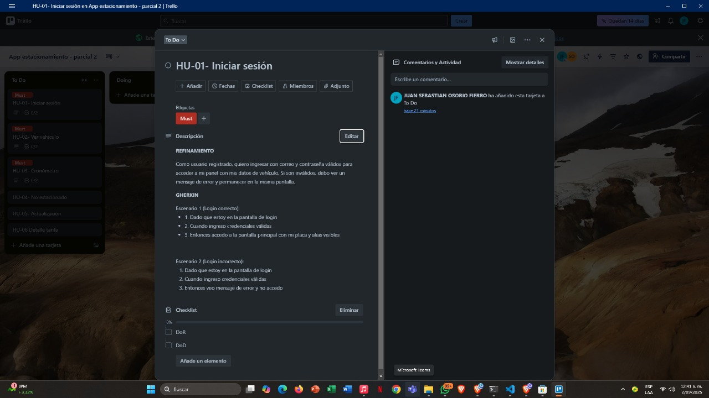
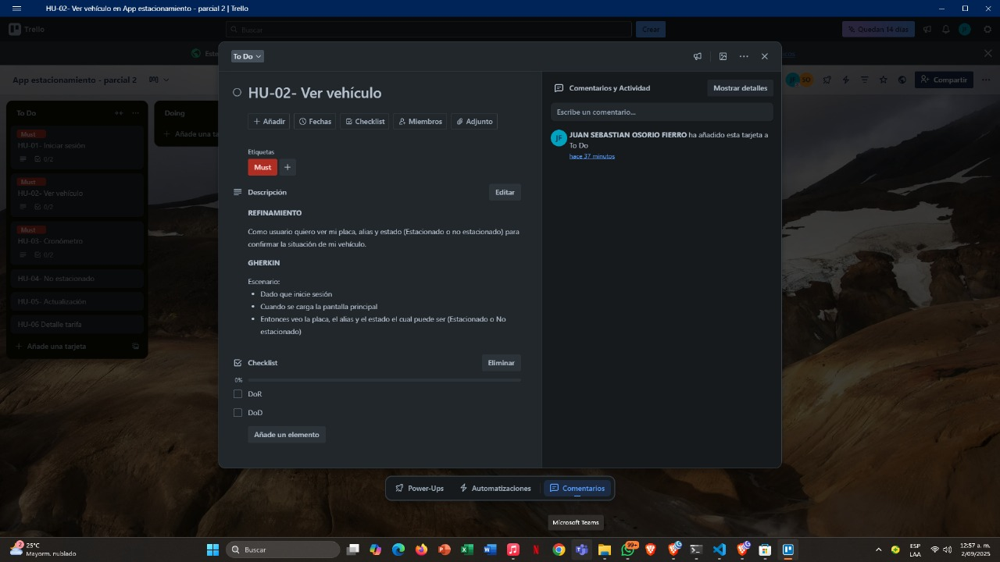
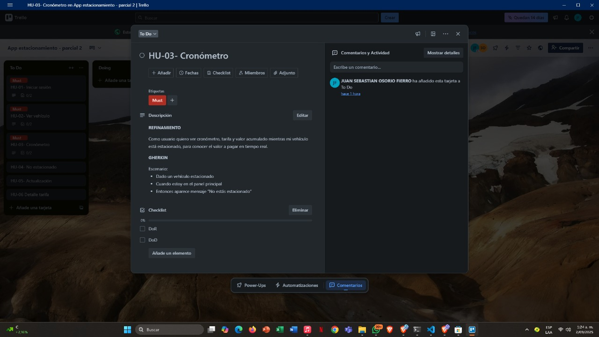
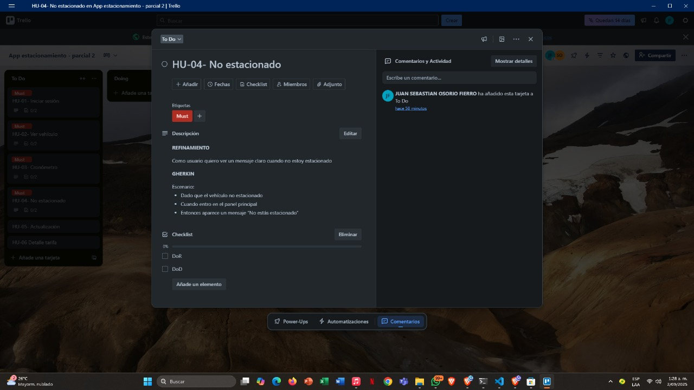
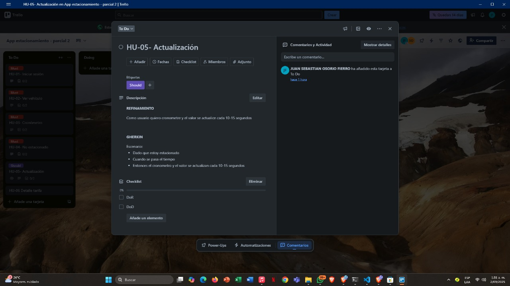
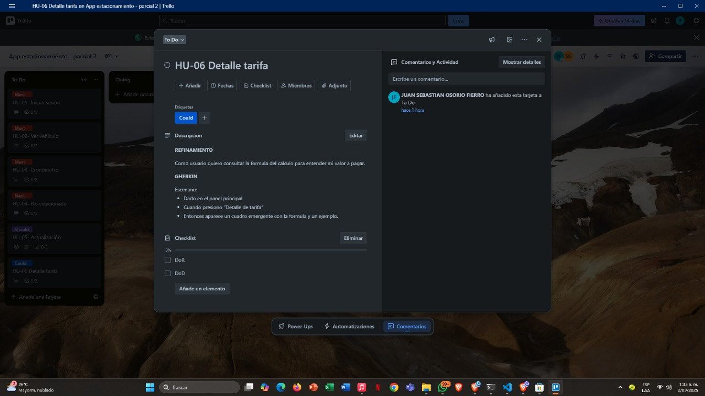
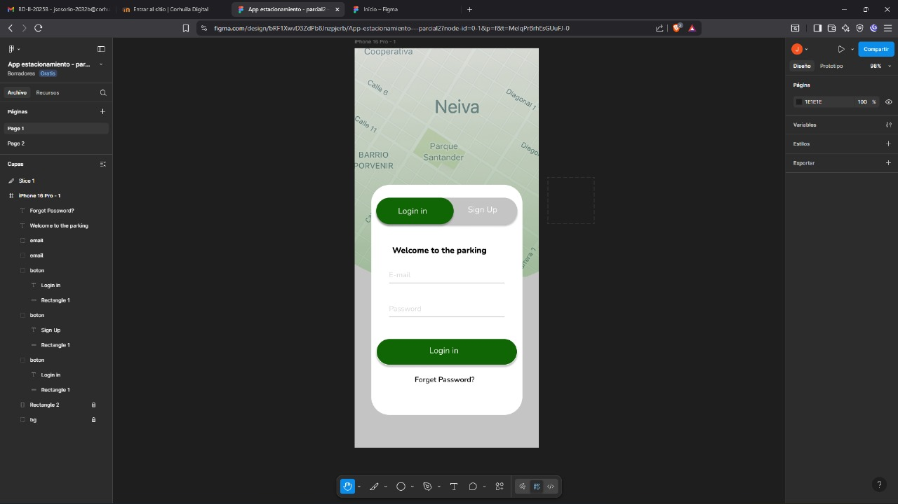
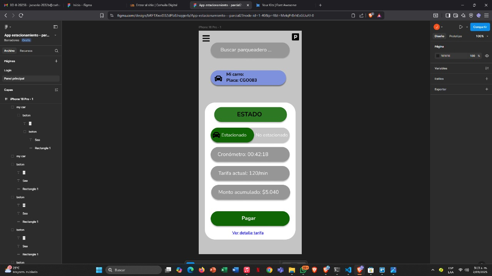
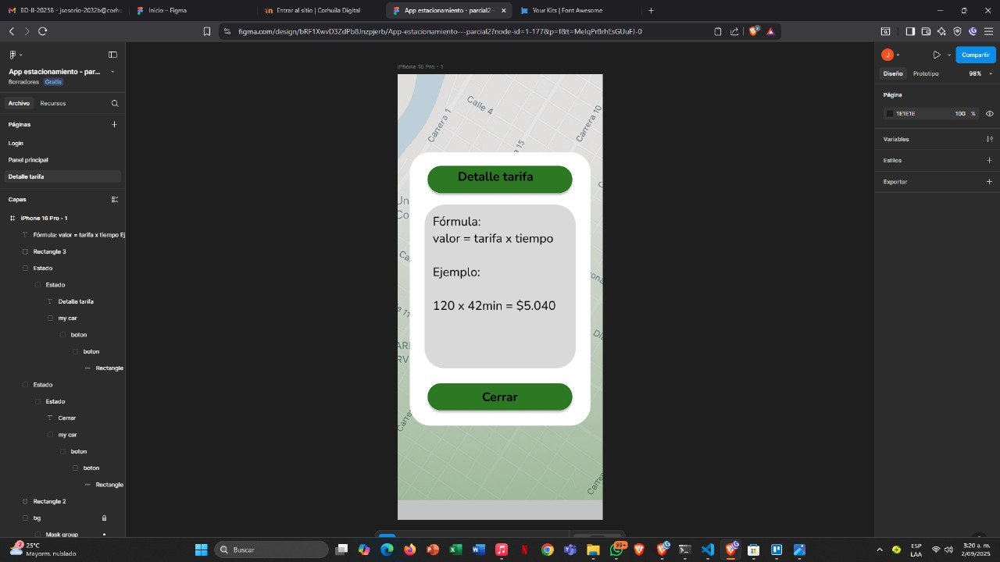

# Parcial Parte 2 – Programación Móvil (Gestión de Estacionamientos)

## Objetivo
Prototipo que muestra en tiempo real el estado del vehículo y el valor a pagar en un tiempo estimado. 

## Backlog (MoSCoW)
- HU-01: Iniciar sesión (Must)
- HU-02: Ver vehículo y estado (Must)
- HU-03: Ver cronómetro, tarifa y valor (Must)
- HU-04: Estado: "No estás estacionado" (Must)
- HU-05: Actualización periódica (Should)
- HU-06: Detalle de tarifa (Could)

## Historias de Usuario (Refinadas, Gherkin, DoR, DoD)

### HU-01 – Iniciar sesión
**Refinamiento:** Como usuario registrado, quiero ingresar con correo y contraseña válidos para acceder a mi perfil con mis datos del vehículo.  
**Gherkin:**  

## Escenario 1:
- Dado que estoy en la pantalla de login  
- Cuando ingreso credenciales válidas  
- Entonces accedo a la pantalla principal

## Escenario 2: 
- Dado que estoy en la pantalla de login  
- Cuando ingreso credenciales inválidas  
- Entonces veo mensaje de error y no accedo 

**DoR:** 
HU clara, criterios definidos, mockup de login creado  
**DoD:**
Acceso con credenciales válidas, error con inválidas, carga de pantalla principal

### HU-02 – Ver vehículo y estado
**Refinamiento:** Como usuario quiero ver mi placa, alias y estado (Estacionado o No estacionado).  
**Gherkin:** 

## Escenario:

- Dado que he iniciado sesión
- Cuando se carga principal
- Entonces veo placa, alias y estado (Estacionado o no estacionado)  

**DoR:** HU detallada, datos de ejemplo definidos, mockup creado  
**DoD:** Se muestra placa y alias correctos, estado cambia según la condición del vehiculo

### HU-03 – Ver cronómetro, tarifa y valor
**Refinamiento:** Como usuario quiero ver cronómetro, tarifa y valor acumulado mientras esté estacionado.  
**Gherkin:** 

## Escenario:

- Dado vehículo estacionado 
- Cuando estoy en el panel principal
- Entonces se muestran cronómetro, tarifa y valor actualizado  

**DoR:** Fórmula definida, mockup con cronómetro creado  
**DoD:** Cronómetro funciona, tarifa visible, monto correcto

### HU-04 – Estado " No estas estacionado"
**Refinamiento:** Como usuario quiero ver un mensaje claro cuando no estoy estacionado.  
**Gherkin:** 

## Escenario:

- Dado que el vehículo no estacionado
- Cuando entro en el panel principal
- Entonces aparece mensaje “No estás estacionado”  

**DoR:** Mockup creado, mensaje definido  
**DoD:** Mensaje visible, sin cronómetro ni deuda

### HU-05 – Actualización periódica
**Refinamiento:** Como usuario quiero que cronómetre y valor se actualicen cada 10–15 segundos.  
**Gherkin:** 

## Escenario:

- Dado que estoy estacionado
- Cuando se pasa el tiempo
- Entonces el cronómetro y valor se actualizan cada 10–15s  

**DoR:** Prototipo en Figma definido, criterio acordado  
**DoD:** Cronómetro se actualiza, valor cambia proporcionalmente, no bloquea interfaz

### HU-06 – Detalle de tarifa
**Refinamiento:** Como usuario quiero consultar la fórmula del cálculo para entender mi valor a pagar.
**Gherkin:** 

## Escenario:

- Dado en el panel principal
- Cuando presiono “Detalle de tarifa” 
- Entonces aparece un cuadro emergente con fórmula y un ejemplo  

**DoR:** Ventana emergente  diseñado en mockup, fórmula confirmada  
**DoD:** Ventana emergente se abre al pulsar botón, incluye fórmula y ejemplo visible

## LINK DE TRELLO 

https://trello.com/invite/b/68b67d6a11ae241dcc76e76f/ATTIe8b731396e5a86286a082644f56692c7B693C0BE/app-estacionamiento-parcial-2

## Mockups
- Login

- Principal

- ventana emergente – Detalle tarifa

## Link figma

https://www.figma.com/design/bRF1XwvD3ZdPb8Jnzpjerb/App-estacionamiento---parcial2?node-id=0-1&t=MelqPrBrhEsGUuFJ-1

## Flujo esperado
Login → Principal → ventana emergente de tarifa

## link del video - drive 

https://drive.google.com/drive/folders/1lsXMtNZyMGSM58LUR_RK2mHEnC6jcM50 