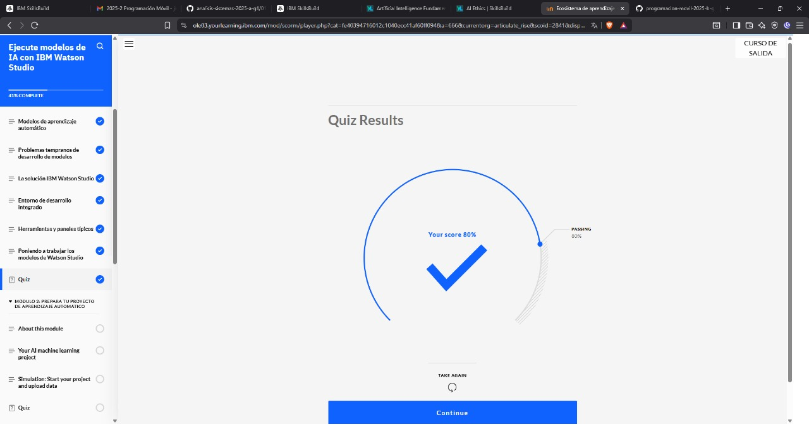
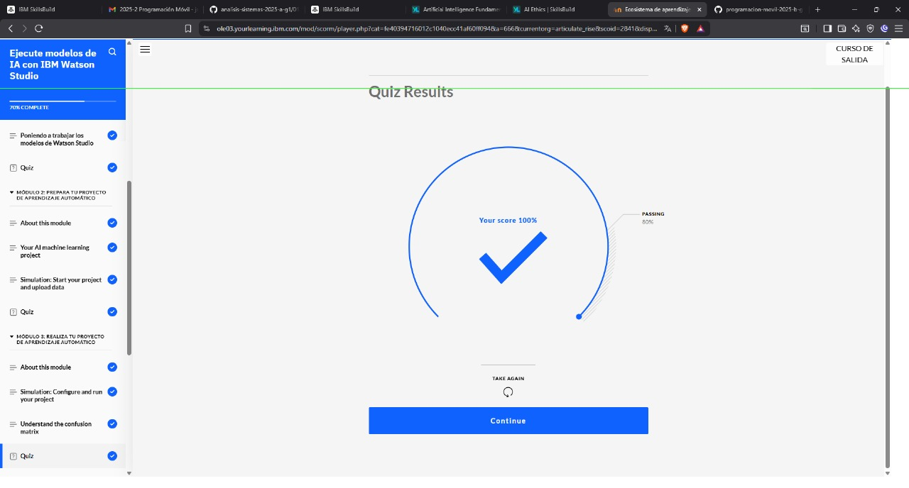
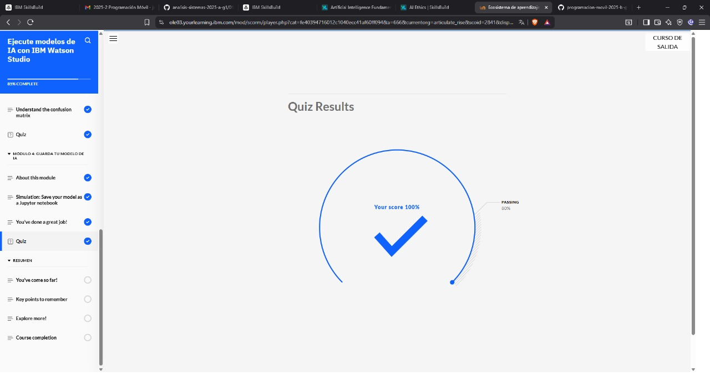

## INTRODUCCIUON 

# El aprendizaje automático consiste, al final, en hacer predicciones utilizando estadísticas y cálculo; ambos se utilizan en fragmentos de código llamados algoritmos de aprendizaje automático. Estos fragmentos de código, a su vez, pueden organizarse en programas informáticos a gran escala llamados modelos de aprendizaje automático. Su comprensión del aprendizaje automático y cómo se ejecuta en Estudio IBM Watson comienza con una exploración de estos dos conceptos.

## QUIZ 

## QUIZ 

## QUIZ 

