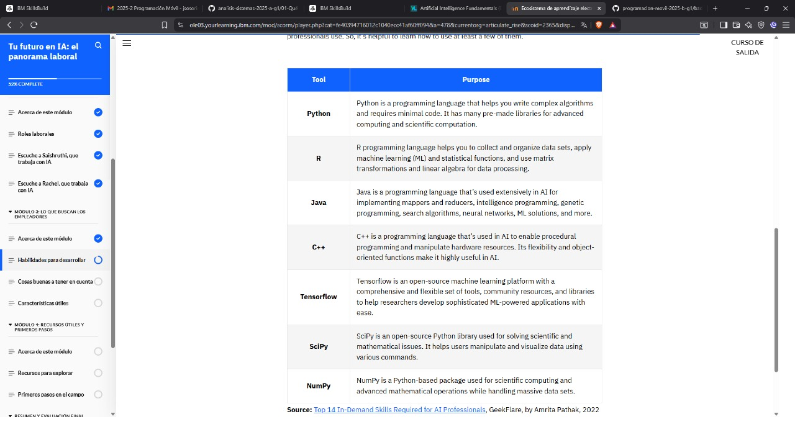
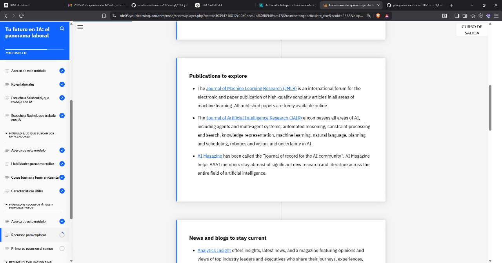
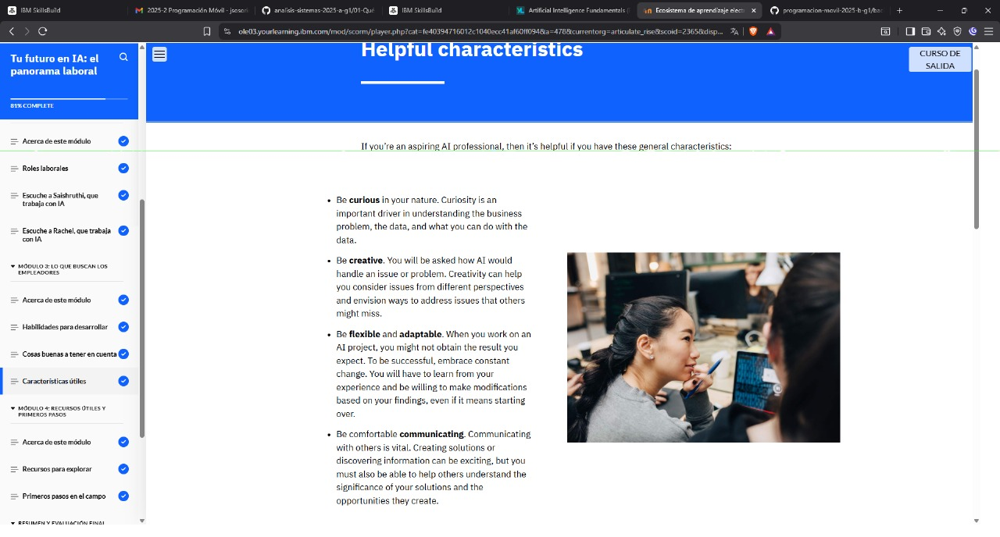
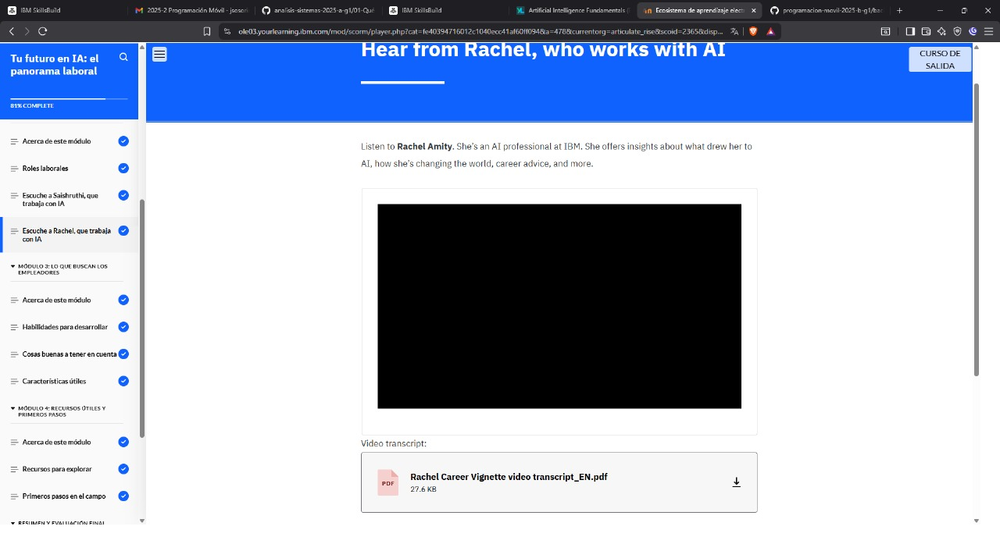
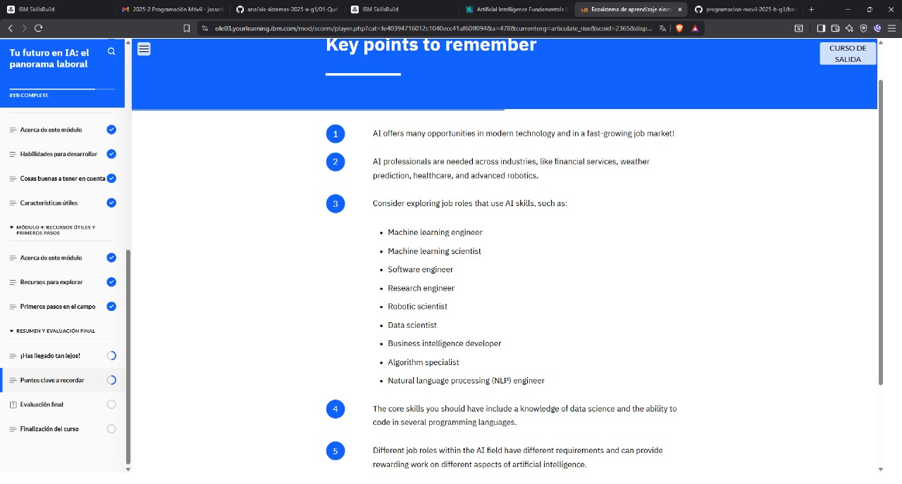
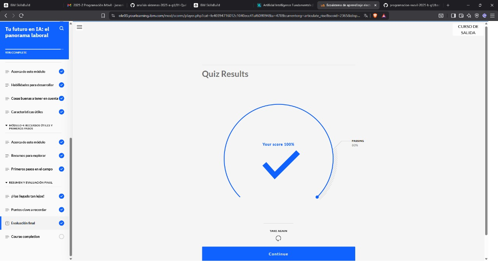

## INTRODUCCION

## ¿Estás considerando una carrera en inteligencia artificial? En este módulo, aprenderá sobre las industrias que necesitan profesionales de IA, el panorama laboral y el posible futuro de la IA.

Objetivos de aprendizaje

Después de completar este módulo, deberías poder:

1. Identificar industrias en las que trabajan los profesionales de la IA
2. Reconocer la demanda mundial de especialistas en IA en el mercado laboral
3. Describe un posible futuro para la IA

## QUIZ 

## QUIZ 

## QUIZ 

## QUIZ 

## QUIZ 

## EXAM 

## EXAM 

