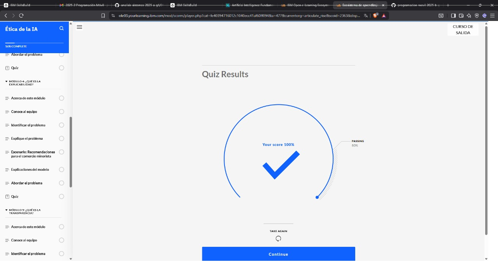
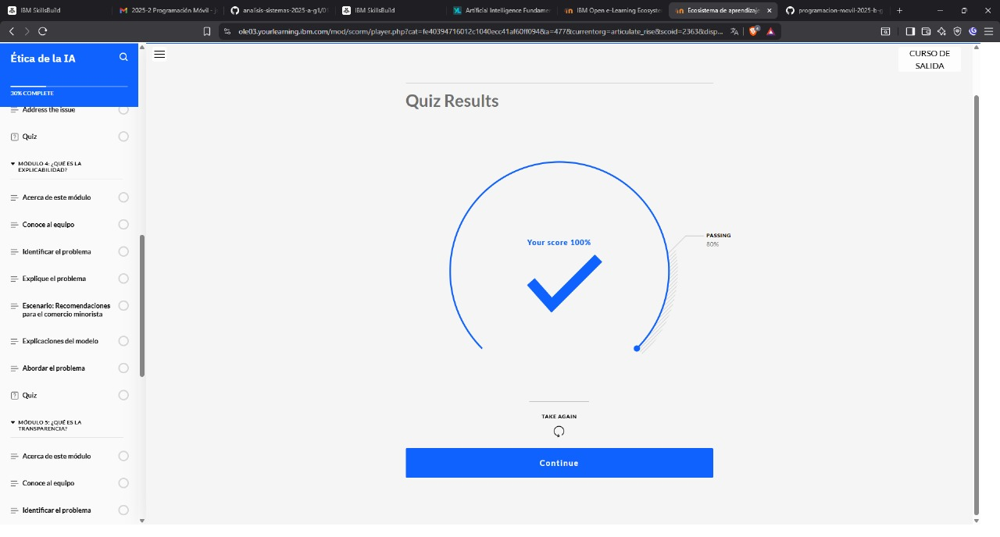
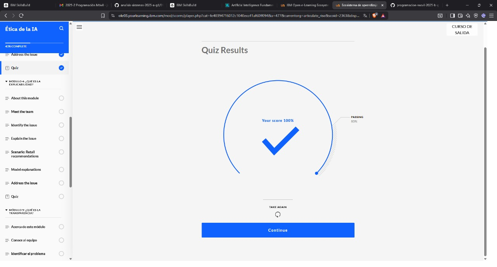
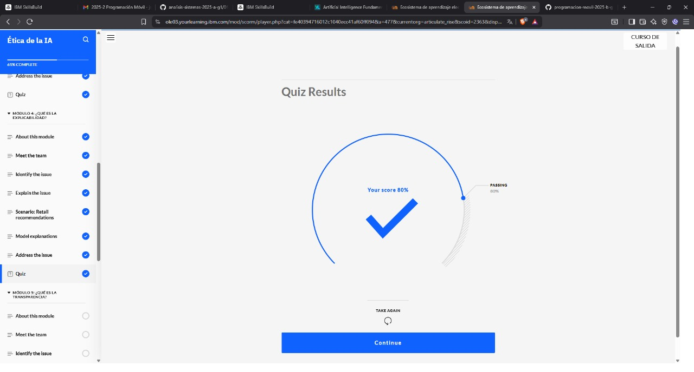

## INTRODUCCION 

Bienvenidos a la Ética de la IA ¡curso! En este curso, te familiarizarás con conceptos sobre la ética de la IA. La ética de la IA es un campo multidisciplinario que estudia cómo optimizar el impacto beneficioso de la IA y al mismo tiempo reducir los resultados no deseados o adversos. La confianza en la IA se basa en cinco pilares éticos:

- Fairness
- Robusta
- Explicabilidad
- Transparencia
- Privacidad

## QUIZ 

## QUIZ 

## QUIZ 

## QUIZ 

## QUIZ 

## EXAM 

## EXAM 

