## INTRODUCCION A LA INTELIGENCIA ARTIFICIAL

 ¿Sabías que la inteligencia artificial está en todas partes— en tu teléfono inteligente, en automóviles, hospitales y en muchos otros aspectos de tu vida? La inteligencia artificial registra y analiza las cosas que haces todos los días, y los humanos toman decisiones basadas en esas cosas.

# Inteligencia artificial:                                                                              

- Recomienda productos que quizás quieras comprar en Internet
- Le avisa si su reloj inteligente o pulsera de actividad física detecta niveles bajos de oxígeno en el torrente sanguíneo, inflamación o un aumento no saludable del azúcar en sangre
- Escanea tus publicaciones en las redes sociales para obtener más información sobre lo que estás pensando
- Ayuda a los bancos a invertir dinero en las cuentas bancarias de su familia para mantener la economía que lo rodea en crecimiento

## QUIZ 

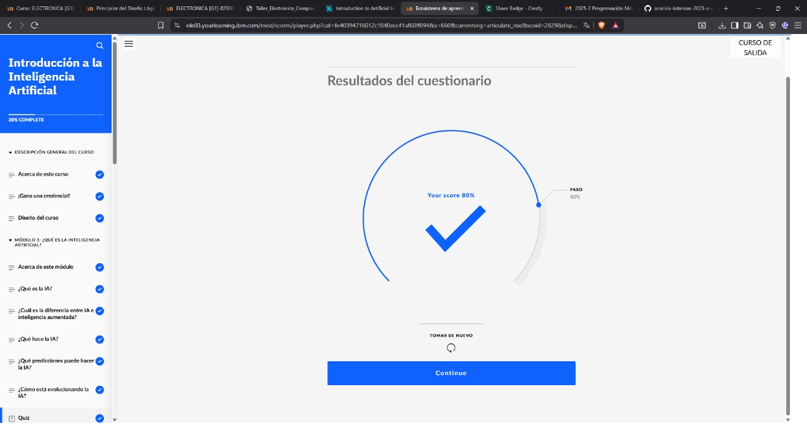

## ¿Cuales son las 3 eras de la informatica?

1. LA ERA DE LA TABULACION 

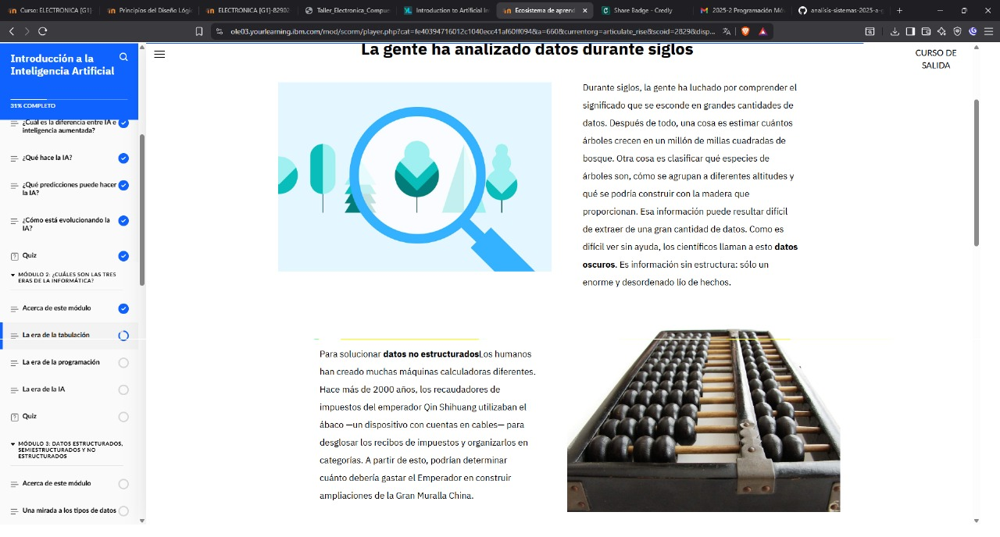

2. LA ERA DE LA PROGRAMACIÓN 

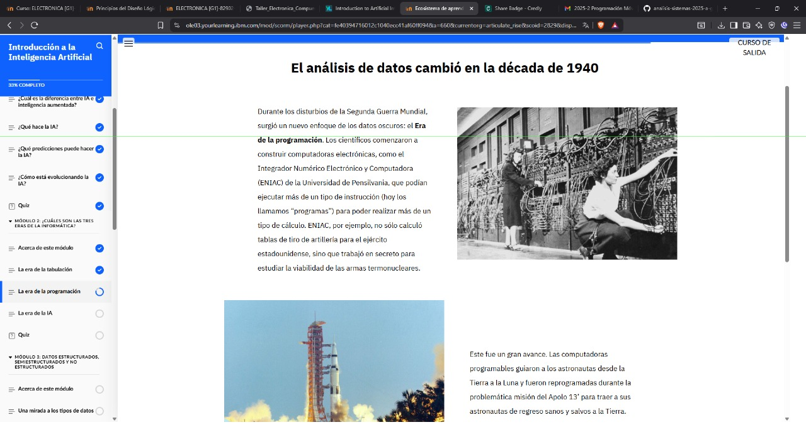

3. LA ERA DE LA AI

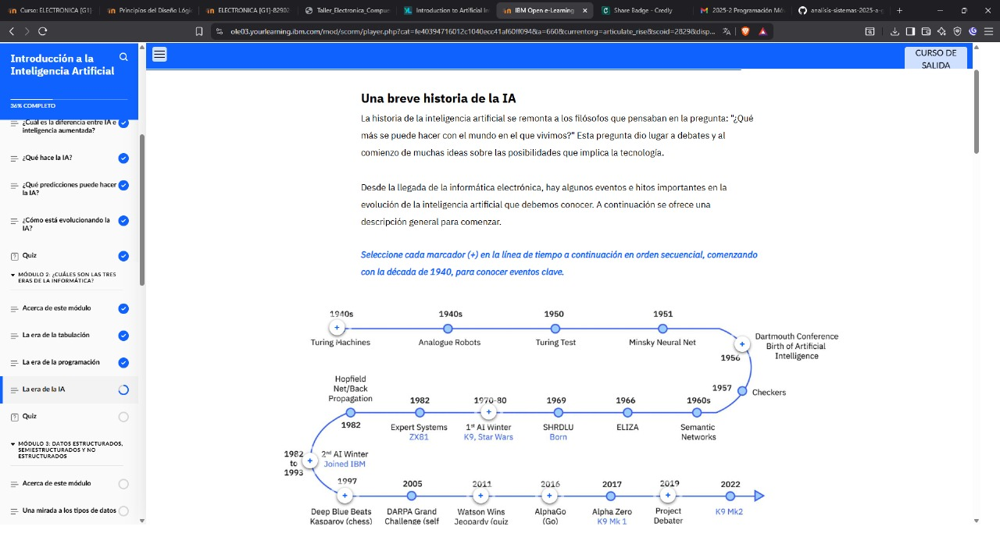

## QUIZ DE LAS ERAS DE LA INFORMATICA

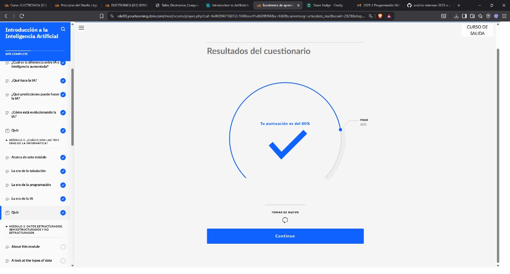

## DATOS ESTRUCTURADOS, SEMIESTRUCTURADOS Y NO ESTRUCTURADOS

- Datos es información sin procesar. Los datos pueden ser hechos, estadísticas, opiniones o cualquier tipo de contenido que se registre en algún formato. ¡Esto podría incluir voces, fotos, nombres e incluso movimientos de baile!

# Los datos se pueden organizar en los siguientes tres tipos.

1. Datos estructurados: Generalmente se clasifica como cuantitativo datos y está altamente organizado. Los datos estructurados son información que se puede organizar en filas y columnas. Quizás hayas visto datos estructurados en una hoja de cálculo, como Google Sheets o Microsoft Excel. Ejemplos de datos estructurados incluyen nombres, fechas, direcciones, números de tarjetas de crédito e información sobre acciones.
2. Datos no estructurados: también conocido como datos oscuros, normalmente se clasifica como cualitativo datos. No puede procesarse ni analizarse mediante herramientas y métodos de datos convencionales. Los datos no estructurados carecen de cualquier organización o estructura incorporada. Ejemplos de datos no estructurados incluyen imágenes, textos, comentarios de clientes, registros médicos e incluso letras de canciones.
3. Datos semiestructurados: es el “puente” entre datos estructurados y no estructurados. No tiene un modelo de datos predefinido. Es combina características tanto de datos estructurados como de datos no estructurados. Es más complejo que los datos estructurados, pero más fácil de almacenar que los datos no estructurados. Usos de datos semiestructurados metadatos identificar características de datos específicas y escalar los datos en registros y campos preestablecidos. En última instancia, los metadatos permiten catalogar, buscar y analizar mejor los datos semiestructurados que los datos no estructurados. Un ejemplo de datos semiestructurados es un vídeo en un sitio de redes sociales. El vídeo en sí es un dato no estructurado, pero normalmente tiene texto para Internet para categorizar fácilmente esa información, por ejemplo a través de un hashtag para identificar una ubicación.

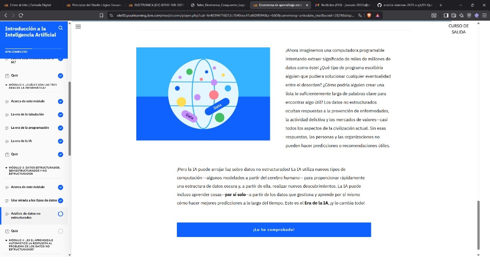

## QUIZ 

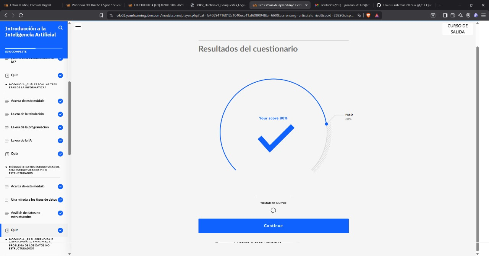

## QUIZ 

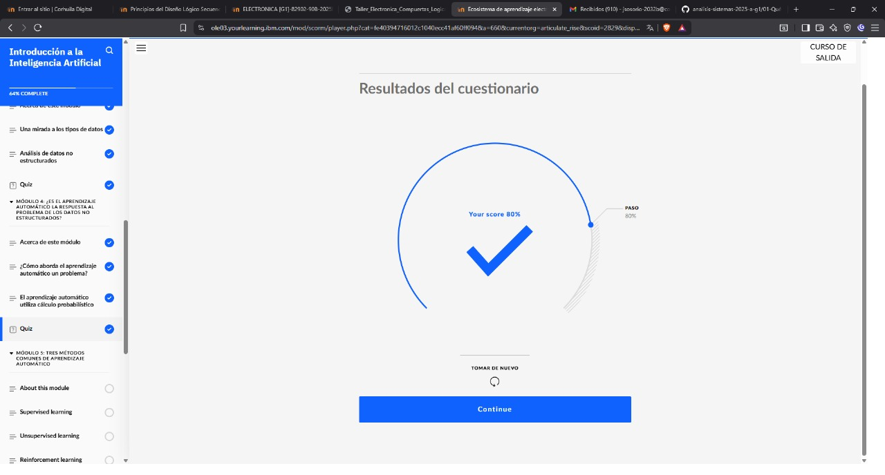

## QUIZ 

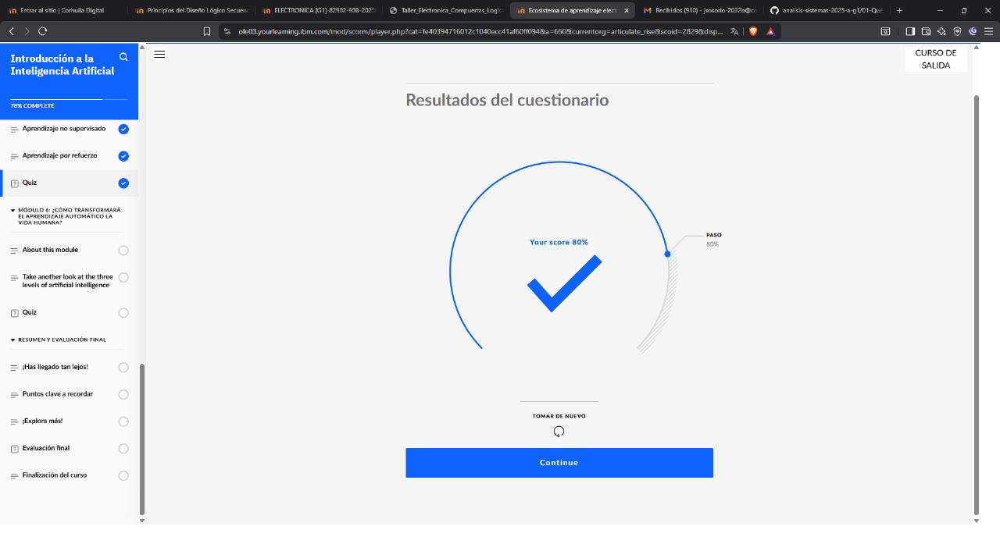

## QUIZ 

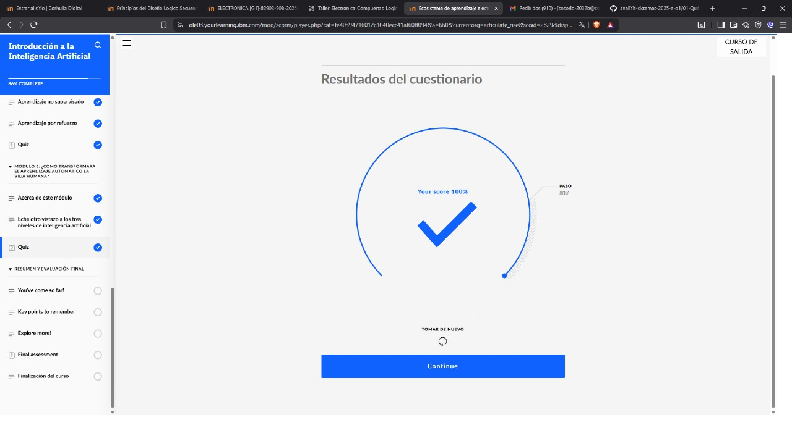

## EVALUACION MODULO

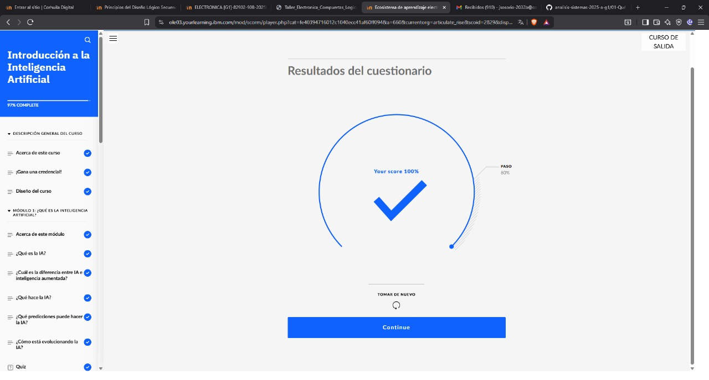
