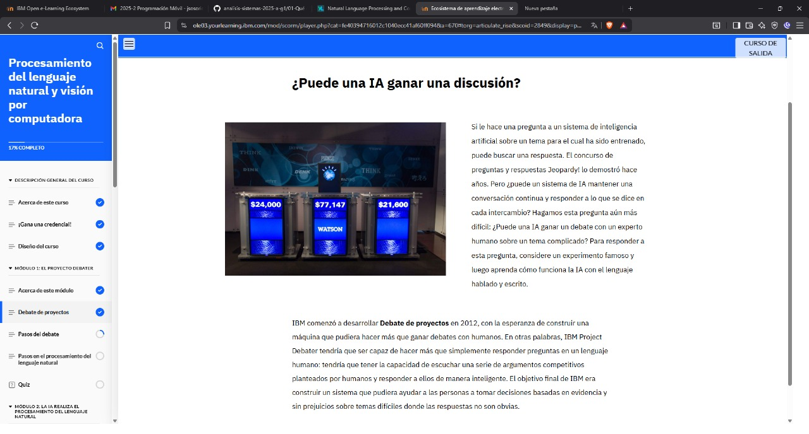

## INTRODUCCION: 

- Todos los días, las computadoras te ayudan a comprender las cosas que escuchan y ven. Tu teléfono responde a tus preguntas y órdenes verbales. Los sistemas de gestión del tráfico observan calles y autopistas para sugerirle rutas ideales para viajar. ¡Las computadoras responden a tus necesidades y te ayudan a tomar buenas decisiones! Piense en la inteligencia artificial (IA) como máquinas de predicción que aumentan la inteligencia humana y proporcionan información.

## DEBATE DE PROYECTOS 

## QUIZ 

## QUIZ 

## QUIZ 

## QUIZ 

## EXAM 

